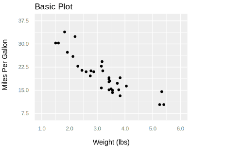
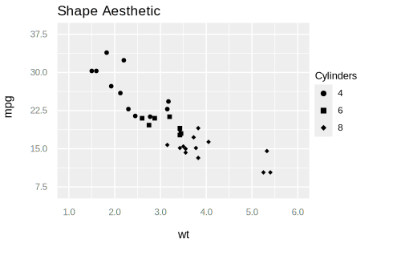
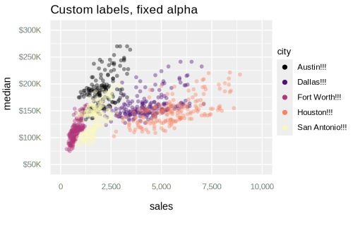
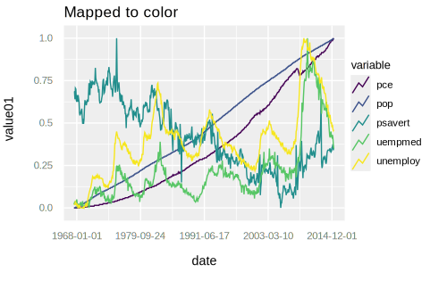

**UPDATE** - a website with usage examples is now up and running at: http://www.pocketbookvote.com.

# GGity

[](https://hex.pm/packages/ggity)
[](https://hexdocs.pm/ggity/)
[](https://hex.pm/packages/ggity)
[](https://github.com/srowley/ggity/blob/master/LICENSE)
[](https://github.com/srowley/ggity/commits/master)

GGity brings the familiar interface of R's ggplot2 library to SVG charting in Elixir.

## Examples

A GGity plot is constructed from data, a geom (such as points, bars or lines) and a mapping of aesthetics (x, y, color, size, etc.) to variables in the data.

Data must be provided as a list of maps, where each map is an observation, and the map's keys are the names of the variables observed.

The mapping is specified with a map containing key-value pairs of variable names and aesthetics. Mappings must be provided for the x and y aesthetics; other aesthetics are optional, with fixed default values applied if a mapping is not specified. See the documentation for supported aesthetics for each geom.

```elixir
Examples.mtcars()
|> Plot.new(%{x: :wt, y: :mpg})
|> Plot.labs(title: "Basic Plot", x: "Weight (lbs)", y: "Miles Per Gallon")
|> Plot.geom_point()
|> Plot.plot()
```


Note that the library includes a few of R's canonical datasets, which are used in these examples and available to support development as described further below.

Mappings can also be specified when a geom is added:

```elixir
Examples.mtcars()
|> Plot.new(%{x: :wt, y: :mpg})
|> Plot.geom_point(%{shape: :cyl})
|> Plot.labs(title: "Shape Aesthetic", shape: "Cylinders")
|> Plot.plot()
```


Legends are currently only supported for discrete scales.

Aesthetics can be assigned a fixed value (not tied to a variable), and both legend
and axis labels support custom formatting.

```elixir
Examples.tx_housing()
|> Enum.filter(fn record ->
  record["city"] in ["Houston", "Fort Worth", "San Antonio", "Dallas", "Austin"]
end)
|> Plot.new(%{x: "sales", y: "median"})
|> Plot.labs(title: "Custom labels, fixed alpha")
|> Plot.geom_point(%{color: "city"}, alpha: 0.4)
|> Plot.scale_x_continuous(labels: :commas)
|> Plot.scale_y_continuous(labels: fn value -> "$#{Labels.commas(round(value / 1000))}K" end)
|> Plot.scale_color_viridis(option: :magma, labels: fn value -> "#{value}!!!" end)
|> Plot.plot()
```


Line geoms support mapping discrete variables to color or line type.

```elixir
Examples.economics_long()
|> Plot.new(%{x: "date", y: "value01"})
|> Plot.labs(title: "Mapped to color")
|> Plot.geom_line(%{color: "variable"})
|> Plot.plot()
```


Bar charts are also supported. By default they display stacked counts of observations (as shown below), but they can also display grouped bars (`position = "dodge"` in ggplot2 parlance) as well as raw y values (`geom_col`).

```elixir
Examples.mpg()
|> Enum.filter(fn record ->
  record["manufacturer"] in ["chevrolet", "audi", "ford", "nissan", "subaru"]
end)
|> Plot.new(%{x: "manufacturer"})
|> Plot.geom_bar(%{fill: "class"})
|> Plot.scale_fill_viridis(option: :inferno)
|> Plot.plot()
```


## Goals
I am interested in data visualization and after learning a lot from the work being done on [ContEx](https://github.com/mindok/contex), I decided that starting to write a basic clone of ggplot2 would help me learn more about the grammar of graphics, ggplot2 and how to develop a reasonably nontrivial library for Elixir.

## Non-Goals
* Meet a real-world need - I code as a hobby, so this is not the product of a real-world use case. There are probably edge cases unaddressed and validations that should be happening, but for now they are harder to find because I am not using this in the wild.

* Optimize for performance pre-emptively - Because I am not using this in a real world application, performance is not as critical or (more importantly) apparent to me, so my focus tends to be on new features.

## Alternatives

[ContEx](https://github.com/mindok/contex) - is more widely used, has some special LiveView features, Gantt charts and (very cool) sparklines. It is also guided by grammar of graphics concepts but is not as dogmatic about it as this library will be.

[Plotex](https://github.com/elcritch/plotex) - focused on time series. Dates/times are hard, and while I have not looked at it in detail I bet Plotex does them better than GGity.

## Development

### Roadmap

GGity has a roadmap which is subject to change based on what is interesting to me, how difficult those items turn out to be to implement and issues/ideas/contribution from others.

### Visual tests
GGity has decent unit test coverage, but given the domain, a picture is worth a thousand words. Therefore the library includes some mix tasks that generate plots of the included datasets to support development. I have used them on Ubuntu Linux and WSL on Windows.

Linux examples:

```bash
mix ggity.visual.geom.point
# Generates a file with point geom examples and opens in Firefox.

mix ggity.visual.geom.line google-chrome
# Generates a file with line geom examples and opens in Chrome.
# Any browser can be specified using the binary name that would launch it
# from the terminal; Firefox is the default if nothing is specified.

mix ggity.visual
# Generates all of the example files and opens them in Firefox.
# Each file is opened in sequence and the next file launches when
# the preceding browser instance is closed.
```

WSL example:

```bash
mix ggity.visual.geom.point --wsl
# The --wsl option works for WSL users by generating a file with
# point geom examples and opening the file in Firefox in Windows
# assuming Firefox is installed in the default location.
# If a browser window is already opened, each example will open a new tab;
# otherwise the behavior is the same as in Linux.
# The --wsl option doesn't support other browsers on Windows at this time.
```

### Other checks

The library also includes an alias (```mix checks```) that runs Credo, Dialyzer, the visual tests and formatter in sequence. I prefer to have all of those things in order before committing a change.

## Acknowledgements

I am very grateful to @mindok, the author of ContEx, who graciously accepted and provided feedback on contributions to that library, which in turn inspired me to write this (and flat out copy some a few parts of ContEx in so doing). I do not view GGity as a replacement for ContEx; it is a personal opportunity for me to learn a lot at my own pace. I made it public in case it might be helpful to others as an example.

Acknowledgement is also due to Hadley Wickham and others who have built [ggplot2](https://ggplot2.tidyverse.org/); the library is great, but Wickham's grammar of graphics is really an excellent piece of academic work in its own right. Along with Edward Tufte's book I think it is safe to say a golden age of visualization ensued.

## Installation

Add `:ggity` to your list of dependencies in mix.exs:

```elixir
def deps do
  [
    {:ggity, "~> 0.3.0"}
  ]
end
```

GGity requires Elixir 1.10, and will likely require Elixir 1.11 shortly after that version is released, due to the nice improvements in each version associated with handling dates and datetimes.

## License

This source code is licensed under the MIT license. Copyright (c) 2020-present, Steve Rowley.
